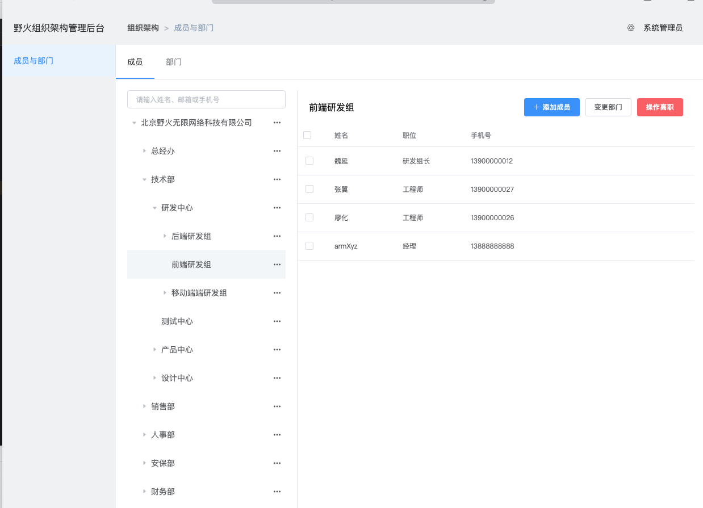
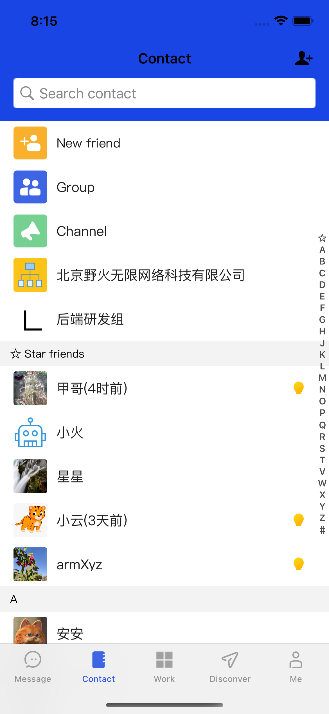
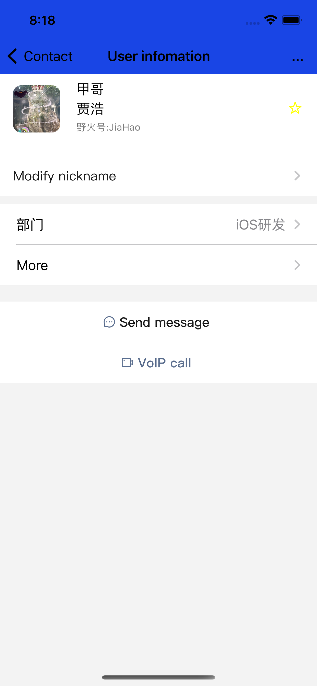
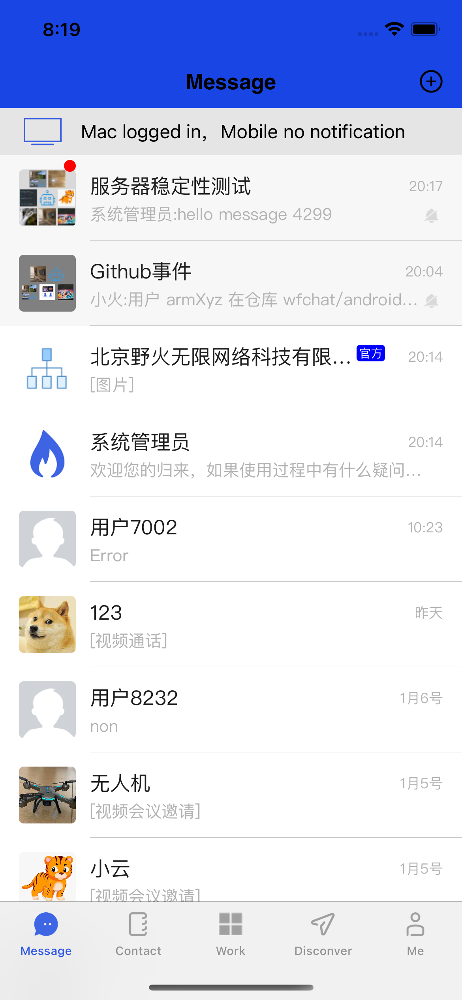

# 野火组织通讯录服务
组织通讯录服务提供企业或者单位组织架构和员工信息服务，员工可以浏览组织架构、选取员工来发送消息和发起音视频通话，不用添加好友既可以进行。野火组织通讯录服务包括后端服务和管理后台页面。可以登录管理后台进行组织管理。

## 后端服务
在后端服务中，提供两种类型的API，一种给管理页面用；另外一种给客户端查询使用。管理页面根据后台数据库中的用户/密码来登录。客户端在im client中取应用code，然后使用code来登录。管理页面可以修改组织通讯录数据，客户端只能查询。

## 数据结构
系统中有3种数据结构，分别是组织、员工和关系。关系数据比较特殊，在关系数据中记录员工与组织的层级关系。比如一个员工甲的组织路径为"公司/技术部/移动端/Android"，那么数据结构就存在下面4行

|  员工   | 部门  |  层级  | 上级部门 | 直属 |
|  ----  | ----  | ----  | ---- | ---- |
| 甲  | 公司 |  0  |  NULL | false |
| 甲  | 技术部 |  1  |  公司 | false |
| 甲  | 移动端 |  2  |  技术部 | false |
| 甲  | Android |  3  |  移动端 | true |

可以看出数据中存在大量的冗余数据，数据维护难度较大，但带来的好处就是查询比较方便和高效。

员工支持多部门，一个员工可以在多个部门中任职。

## 客户端使用
客户端登录成功以后，可以调用各个查询接口。一般在进入到通讯录界面，可以调取获取根组织的方法，获取公司。然后点开公司再一级一级地展开数据。

在用户的详情界面，可以查询用户的组织关系，这样就能展示用户的组织路径。点击具体路径就可以获取对应组织的信息详情。

客户端可以本地缓存数据，在需要显示时先使用缓存，再去服务器查询，如果有更新再刷新页面。

## 编译
组织通讯录服务包含后端服务和管理页面，需要分别进行编译。

### 管理页面的编译
1. 修改配置：
修改```organization-web/src/api/axios.config.js```把baseURL地址改成正确地址。

2. 进入项目的```organization-web```目录下，执行下属命令:
    ```
    npm install
    npm run build
    ```
编译成功后，生成的html文件会自动拷贝到后端服务的资源目录下，这样打包后端服务的时候就可以把页面打包进后端服务了。注意不能使用```yarn```，只能使用```npm```，否则会找不到页面。

### 后端服务的编译
需要先编译管理页面，管理页面编译成功后，进入项目的```organization-server```目录下，执行下属命令:
```
mvn clean package
```
生成的软件包在```organization-server/target/organization-platform-server-XXX.jar```。

## 部署
### 配置
部署之前需要把配置文件目录```organization-server/config```放到软件包的相同目录，然后编辑配置目录下的```application.properties```文件。有如下地方需要修改：
1. 应用的端口，默认是8880，可以修改为其他的端口。
2. 应用使用的数据库，默认是H2，可以直接运行，建议切换到mysql。
3. IM服务的Server API地址和密钥，必须修改为有效信息。
4. 否允许外部人员访问组织，如果是则非公司员工也可以看到组织通讯录，否则看不到。
5. 对象存储信息，配置之后可以在创建员工时设置头像等。

### 部署
把软件包```organization-platform-server-XXX.jar```放到云服务器上，确保配置目录在一起并正确配置后，执行命令：
```
nohup java -jar organization-platform-server-*.jar 2>&1 &
```

## 登录
浏览器打开```http://{IP}:8880```进入到管理后台界面，默认账户/密码为 ```admin/admin123```  登陆以后注意修改默认密码。

## 导入数据
在管理后台未创建任何组织的情况下，需要在后台下载导入模版，填入模版后然后上传导入所有组织架构和成员信息。在成员那个页面，选择批量导入，按照提示下载模版和上传文件。

模版中带有示例人员信息，可以导入作为测试数据进行测试。

当数据库中已经有数据的情况下，导入按钮会隐藏，可以手动调整各项数据。

当数据库为空时，无法手动创建用户和组织，必须先导入数据后再手动调整（可以二开来改掉这个限制）。

## 截图

管理后台页面


联系人页面


组织树


员工名片


官方群


## 常见问题
1. 输入地址后，打不开管理页面？
A. 前端页面打包后，会把页面放入到```organization-server\src\main\resources\static```目录中，请检查是否存在。如果不存在，请检查是否执行过编译前端页面。如果用yarn编译，也会出问题，请用npm编译。

2. 登录后无法创建部门？
A. 设计是需要先导入数据，导入数据后再手动更新。请确认先导入后，再手动调整。如果需要手动创建部门，可以二开修改源码。

3. 配置文件中的关于IM的是什么信息？
A. 此服务需要更新IM服务用户信息，因此需要配置IM服务的管理地址和密钥。请修改```im.admin_url```和```im.admin_secret```，改为正确的地址。

4. 部署之后，如何提供给客户端使用？
A. 这个服务还提供API给客户端使用，最简单的方法就是把```http://IP:8880```替换客户端配置文件里的地址。当然建议使用域名和HTTPS，这样能够保证安全还有灵活性。

## Lisence
UNDER MIT LICENSE. 详情见LICENSE文件
